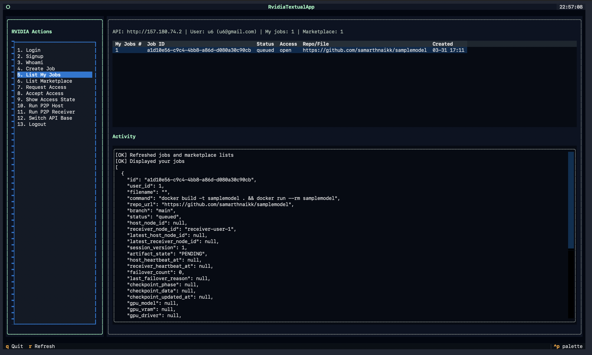
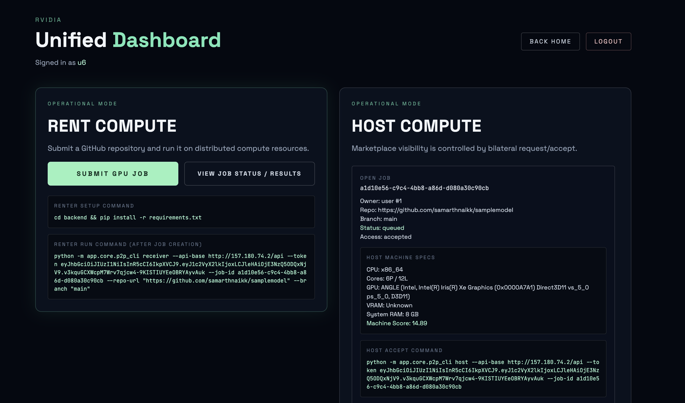
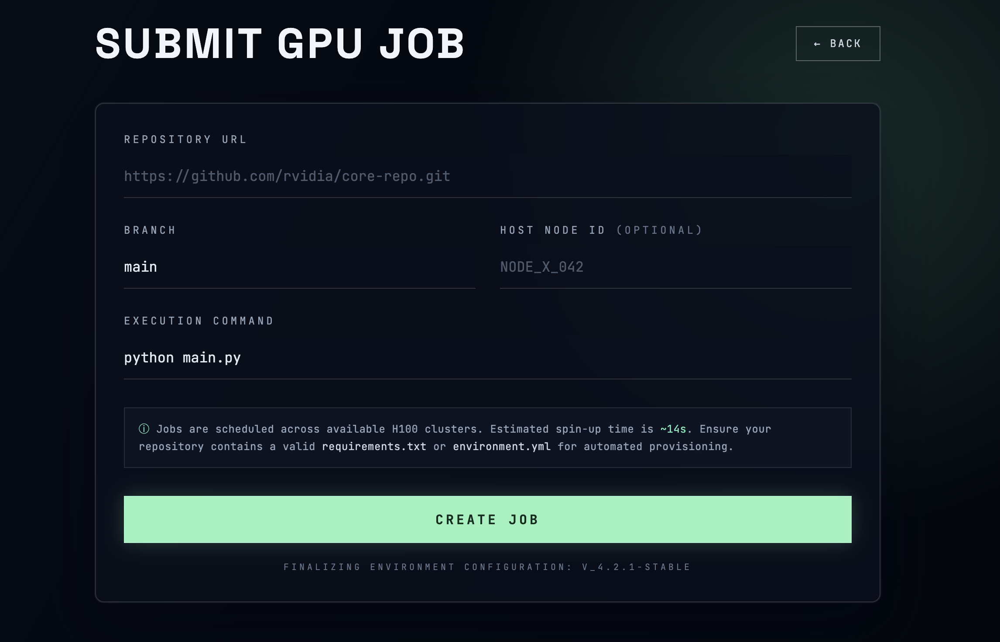
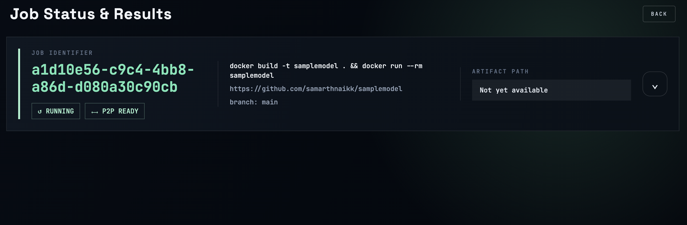

# Rvidia MVP

This repository contains the MVP implementation for:

1. User authentication (signup/login)
2. Job creation and status tracking
3. P2P file + log + artifact transfer using iroh
4. Backend coordination only (no file/log relay through server)

## Project Structure

- `frontend/`: React + Vite UI
- `backend/`: FastAPI API + iroh P2P CLI wrappers
- `nginx/`: optional production reverse proxy
- `postgres/`: PostgreSQL container setup

## Docker Boot (Dev)

Run the complete dev stack with:

```bash
docker compose --profile dev up --build
```

Services:

- Frontend: `http://localhost:3000`
- Backend API: `http://localhost:8000`
- Postgres: `localhost:5432`

## MVP Web Flow

1. Create account from the signup page.
2. Log in from the login page.
3. Open dashboard and submit a job from "Submit GPU Job".
4. View status and results from "View Job Status / Results".

## Screenshots

### Website and CLI Views









## CLI Flow (New)

Use the backend CLI for the same core flow without the website UI.

```bash
cd backend
python -m app.core.client_cli --help
```

Interactive mode (menu-driven, minimal typing):

```bash
pip install -r backend/requirements.txt
python -m app.core.client_cli tui --api-base http://localhost:8000 (or the base url)
```

TUI highlights:
- Built with Textual and themed to match the website's dark + neon green look
- Job picker menus for access, host, and receiver actions (no need to paste IDs each time)
- Auto-filled repo/branch for receiver when available
- Runtime API base switching from inside the menu

Login once (session is persisted at `~/.rvidia-cli/session.json`):

```bash
python -m app.core.client_cli login \
	--api-base http://localhost:8000 \
	--username-or-email <USERNAME_OR_EMAIL> \
	--password <PASSWORD>
```

Create and inspect jobs:

```bash
python -m app.core.client_cli create-job \
	--repo-url https://github.com/<owner>/<repo> \
	--branch main

python -m app.core.client_cli list-jobs
python -m app.core.client_cli get-job --job-id <JOB_ID>
```

Marketplace/consent:

```bash
python -m app.core.client_cli marketplace
python -m app.core.client_cli request-access --job-id <JOB_ID>
python -m app.core.client_cli accept-access --job-id <JOB_ID>
```

Run P2P host/receiver through the CLI wrapper:

```bash
python -m app.core.client_cli p2p-host --job-id <JOB_ID>

python -m app.core.client_cli p2p-receiver \
	--job-id <JOB_ID> \
	--repo-url https://github.com/<owner>/<repo> \
	--branch main
```

## Backend API (MVP)

Auth:

- `POST /auth/signup`
- `POST /auth/login`
- `GET /auth/me`

Jobs:

- `POST /jobs`
- `GET /jobs`
- `GET /jobs/{job_id}`
- `PATCH /jobs/{job_id}/status`
- `POST /jobs/{job_id}/complete`

P2P Coordination:

- `POST /p2p/jobs/{job_id}/register-host`
- `POST /p2p/jobs/{job_id}/register-receiver`
- `GET /p2p/jobs/{job_id}/peers`

## P2P Terminal Commands (Temporary MVP Support)

Use these commands for host/receiver testing on same machine or LAN.

### 1. Start Host

```bash
cd backend
python -m app.core.p2p_cli host \
	--api-base http://157.180.74.2 \
	--token <JWT_TOKEN> \
	--job-id <JOB_ID>
```

### 2. Start Receiver and Connect to Host

```bash
cd backend
python -m app.core.p2p_cli receiver \
	--api-base http://157.180.74.2 \
	--token <JWT_TOKEN> \
	--job-id <JOB_ID> \
	--host-node-id <HOST_NODE_ID> \
	--repo-url https://github.com/<owner>/<repo> \
	--branch main
```

Notes:

- Logs are streamed P2P only (host -> receiver terminal).
- Job source is pulled from the provided public GitHub repository.
- Output artifact return is P2P only.
- Backend only stores coordination and final completion state.

